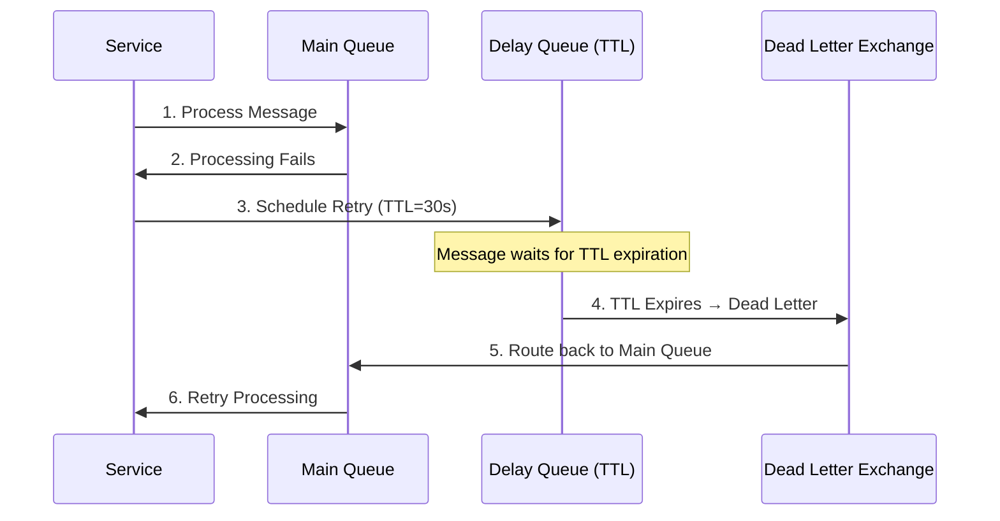

# TTL-based Retry Scheduler

> **⚠️ Go-Only Feature**: TTL-based retry scheduling is only available in the Go implementation of Mmate. The .NET implementation provides basic in-memory retry capabilities only.

The TTL-based retry scheduler provides persistent retry scheduling using RabbitMQ's Dead Letter Exchange (DLX) mechanism. Unlike in-memory retry mechanisms, TTL-based retries survive service restarts and provide guaranteed message delivery with durable scheduling.

## How It Works

The TTL-based retry scheduler uses RabbitMQ native features:

1. **TTL Queues**: Messages are published to temporary queues with specific Time-To-Live values
2. **Dead Letter Exchange**: When messages expire, they're automatically routed to the target queue
3. **Persistent Storage**: Retry schedules are persisted in RabbitMQ, surviving service restarts
4. **Exponential Backoff**: Automatic delay calculation with configurable backoff policies

## Key Benefits

- **Persistence**: Retry schedules survive service restarts and broker restarts
- **Scalability**: No in-memory state required, scales horizontally
- **Reliability**: Uses RabbitMQ's built-in durability guarantees
- **Efficiency**: Offloads retry scheduling to message broker

## Basic Configuration

```go
import (
    "github.com/glimte/mmate-go"
    "github.com/glimte/mmate-go/internal/reliability"
)

// Configure TTL retry policy
retryPolicy := reliability.NewExponentialBackoff(
    100*time.Millisecond, // initial delay
    30*time.Second,       // max delay
    2.0,                  // multiplier
    5,                    // max retries
)

// Create client with TTL retry enabled
client, err := mmate.NewClientWithOptions(connectionString,
    mmate.WithTTLRetry(retryPolicy),
    mmate.WithServiceName("my-service"),
)
```

## Advanced Configuration

### Custom TTL Retry Policy

```go
// Create TTL retry scheduler with custom options
scheduler := reliability.NewTTLRetryScheduler(channelPool, 
    &reliability.TTLRetrySchedulerOptions{
        RetryExchange: "app.retries",
        DelayExchange: "app.retries.delay",
        Logger:        logger,
    })

// Initialize the scheduler topology
err := scheduler.Initialize(context.Background())
if err != nil {
    log.Fatal("Failed to initialize TTL retry scheduler:", err)
}

// Create custom retry policy
customPolicy := reliability.NewExponentialBackoff(
    500*time.Millisecond, // initial delay
    10*time.Minute,       // max delay
    1.5,                  // multiplier
    10,                   // max retries
)

// Use with client
client, err := mmate.NewClientWithOptions(connectionString,
    mmate.WithTTLRetry(customPolicy),
)
```

## Integration with Interceptors

### TTL Retry Interceptor

```go
// TTL retry is automatically integrated when enabled
client, err := mmate.NewClientWithOptions(connectionString,
    mmate.WithTTLRetry(), // Enables TTL retry interceptor
    mmate.WithServiceName("order-service"),
)

// Subscribe to messages with automatic TTL retry
err = client.Subscriber().Subscribe(
    ctx, 
    "orders-queue", 
    "OrderCommand",
    func(ctx context.Context, msg contracts.Message) error {
        // If this returns an error, TTL retry scheduler
        // will automatically schedule retry with persistence
        return processOrder(ctx, msg.(*OrderCommand))
    },
)
```

## Message Flow Example



## Manual TTL Retry Operations

```go
func (s *OrderService) ProcessOrder(ctx context.Context, order *OrderCommand) error {
    err := s.businessLogic.Process(ctx, order)
    if err != nil {
        // Check if this is a retryable error
        if isRetryableError(err) {
            // Get TTL retry scheduler from client
            scheduler := s.client.TTLRetryScheduler()
            if scheduler != nil {
                // Manually schedule retry
                return scheduler.ScheduleRetry(
                    ctx,
                    order,
                    "orders-queue",
                    1, // attempt number
                    s.retryPolicy,
                    30*time.Second, // delay
                    err,            // last error
                )
            }
        }
        return err
    }
    return nil
}
```

## Monitoring TTL Retries

### Retry Metrics

```go
type TTLRetryMetrics struct {
    metrics metrics.Client
}

// Monitor TTL retry scheduling
func (m *TTLRetryMetrics) OnRetryScheduled(
    messageType string, 
    attempt int, 
    delay time.Duration) {
    
    m.metrics.Increment("ttl_retry.scheduled",
        metrics.Tags{
            "message_type":   messageType,
            "attempt":        fmt.Sprintf("%d", attempt),
            "delay_seconds":  fmt.Sprintf("%.1f", delay.Seconds()),
        })
}

// Monitor TTL retry execution
func (m *TTLRetryMetrics) OnRetryExecuted(
    messageType string, 
    attempt int, 
    success bool) {
    
    m.metrics.Increment("ttl_retry.executed",
        metrics.Tags{
            "message_type": messageType,
            "attempt":      fmt.Sprintf("%d", attempt),
            "success":      fmt.Sprintf("%t", success),
        })
}
```

## Testing TTL Retry Logic

```go
func TestTTLRetry_ShouldSchedulePersistentRetry(t *testing.T) {
    // Arrange
    scheduler := reliability.NewTTLRetryScheduler(channelPool, nil)
    err := scheduler.Initialize(context.Background())
    require.NoError(t, err)
    
    message := &OrderCommand{ID: "123"}
    policy := reliability.NewExponentialBackoff(
        100*time.Millisecond, 10*time.Second, 2.0, 3)
    
    // Act
    err = scheduler.ScheduleRetry(
        context.Background(),
        message,
        "orders-queue",
        1, // attempt
        policy,
        5*time.Second, // delay
        errors.New("test error"))
    
    // Assert
    assert.NoError(t, err)
    
    // Verify delay queue exists
    delayQueue := getQueueInfo(t, "mmate.retry.delay.5s")
    assert.Equal(t, 5000, delayQueue.MessageTTL)
    assert.Equal(t, "orders-queue", delayQueue.DeadLetterRoutingKey)
}
```

## Queue Management

### Automatic Queue Cleanup

TTL retry scheduler automatically manages delay queues:

- **Queue Creation**: Delay queues are created on-demand per delay duration
- **Queue Expiration**: Unused delay queues expire automatically (5 minutes after last use)
- **Queue Naming**: Format: `mmate.retry.delay.{seconds}s` (e.g., `mmate.retry.delay.30s`)

### Manual Queue Operations

```go
// TTL retry scheduler handles queue management automatically
// Delay queues are created as needed and cleaned up when expired

// Access the underlying topology manager if needed
topologyManager := scheduler.TopologyManager()

// Check if specific delay queue exists
exists, err := topologyManager.QueueExists(ctx, "mmate.retry.delay.30s")
if err != nil {
    log.Printf("Error checking queue: %v", err)
}
```

## Best Practices

1. **Choose Appropriate TTL Values**
   - Short delays (< 1 minute): Use in-memory retry
   - Long delays (> 1 minute): Use TTL retry
   - Very long delays (> 1 hour): Consider scheduled jobs

2. **Monitor Queue Growth**
   - Track delay queue message counts
   - Alert on excessive retry accumulation
   - Monitor queue creation/deletion patterns

3. **Error Classification**
   - Use TTL retry for transient errors
   - Fast-fail on permanent errors
   - Combine with circuit breaker for cascading failures

4. **Resource Management**
   - TTL scheduler automatically manages delay queues
   - Queues expire when unused (default: 5 minutes)
   - No manual cleanup required

5. **Testing Considerations**
   - Use shorter TTL values in tests
   - Verify queue creation and message routing
   - Test retry exhaustion scenarios

## Troubleshooting

### Common Issues

**Retry Messages Not Processed**
- Check delay queue bindings to retry exchange
- Verify TTL values are correctly set
- Ensure retry exchange routes to target queue

**Queue Accumulation**
- Monitor retry rates and patterns
- Check for infinite retry loops
- Verify retry policy limits

**Performance Impact**
- TTL retry uses additional queues and exchanges
- Monitor broker memory usage
- Consider retry frequency and volume

### Debugging

```go
// Enable detailed logging for TTL retry
logger := slog.New(slog.NewJSONHandler(os.Stdout, &slog.HandlerOptions{
    Level: slog.LevelDebug,
}))

scheduler := reliability.NewTTLRetryScheduler(channelPool, 
    &reliability.TTLRetrySchedulerOptions{
        Logger: logger,
    })

// Logs will show:
// - Queue creation and binding
// - Message scheduling details
// - TTL expiration and routing
// - Error conditions and recovery
```